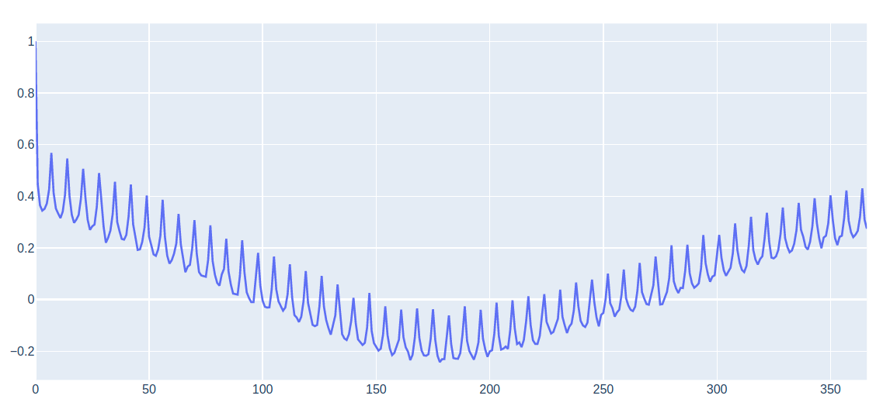
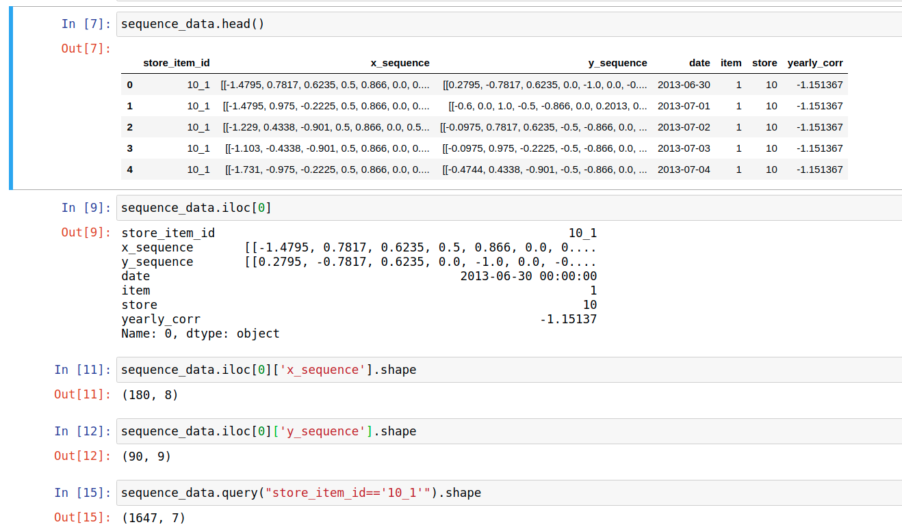

- [Data](#data)
- [Feature engineering](#feature-engineering)
  - [train data](#train-data)
  - [test data](#test-data)
  - [target](#target)
  - [steps](#steps)
    - [add `sales` to test data](#add-sales-to-test-data)
    - [concatenate test/train data](#concatenate-testtrain-data)
    - [concatenate store/item](#concatenate-storeitem)
    - [add day of week, day of month, year, month, normalized year (`year_mod`)](#add-day-of-week-day-of-month-year-month-normalized-year-year_mod)
    - [transform cyclical features](#transform-cyclical-features)
    - [drop `id` and sort by store/item date](#drop-id-and-sort-by-storeitem-date)
    - [ACF](#acf)
    - [scale data and add yearly ACF for each store/item](#scale-data-and-add-yearly-acf-for-each-storeitem)
    - [reduce memory of pandas dataframe](#reduce-memory-of-pandas-dataframe)
    - [create sequences](#create-sequences)
- [Training](#training)
  - [test data](#test-data-1)
  - [train/valid data](#trainvalid-data)
  - [PyTorch `Dataset`](#pytorch-dataset)
  - [Encoder (`RNNEncoder`@`ts_models/encoders.py`)](#encoder-rnnencoderts_modelsencoderspy)
    - [Input](#input)
    - [Model Init](#model-init)
    - [Initialize hidden state to zeros](#initialize-hidden-state-to-zeros)
    - [Input sequence](#input-sequence)
    - [Output (`gru_out`)](#output-gru_out)
    - [hidden state (`hidden`)](#hidden-state-hidden)
    - [If `bidirectional=True`](#if-bidirectionaltrue)
      - [Initialize hidden state to zeros](#initialize-hidden-state-to-zeros-1)
      - [Input sequence](#input-sequence-1)
      - [Output (`gru_out`)](#output-gru_out-1)
      - [hidden state (`hidden`)](#hidden-state-hidden-1)
      - [Modify `gru_out`](#modify-gru_out)
      - [Modify `hidden`](#modify-hidden)
  - [Decoder](#decoder)
    - [Decoder Input (`EncoderDecoderWrapper`@`ts_models/encoder_decoder.py`)](#decoder-input-encoderdecoderwrapperts_modelsencoder_decoderpy)
      - [Previous hidden state](#previous-hidden-state)
      - [`outputs`](#outputs)
      - [previous sequence input](#previous-sequence-input)
    - [Loop through output size steps (i.e. `90`)](#loop-through-output-size-steps-ie-90)
      - [Run `prev_hidden` and `step_decoder_input` through decoder](#run-prev_hidden-and-step_decoder_input-through-decoder)
        - [Initialized decoder](#initialized-decoder)
        - [Forward](#forward)
        - [Assign next values of decoder input](#assign-next-values-of-decoder-input)
        - [Save output results](#save-output-results)
  - [Decoder with attention (`AttentionDecoderCell` in `ts_models/decoders.py`)](#decoder-with-attention-attentiondecodercell-in-ts_modelsdecoderspy)
    - [Concatenate previous hidden state and encoder input](#concatenate-previous-hidden-state-and-encoder-input)
    - [Apply sotfmax/linear layer](#apply-sotfmaxlinear-layer)
    - [Apply attention](#apply-attention)
      - [Attention weights](#attention-weights)
      - [Encoder output](#encoder-output)
      - [Combine with decoder input](#combine-with-decoder-input)
        - [Concatenate](#concatenate)
        - [Apply Linear/relu](#apply-linearrelu)
        - [Result](#result)
      - [Run through GRUcell](#run-through-grucell)
      - [Output](#output)
      - [Return](#return)
  - [Overall training scheme](#overall-training-scheme)
# Data 
https://www.kaggle.com/c/demand-forecasting-kernels-only/data 
# Feature engineering
## train data
```
         date  store  item  sales
0  2013-01-01      1     1     13
1  2013-01-02      1     1     11
2  2013-01-03      1     1     14
3  2013-01-04      1     1     13
4  2013-01-05      1     1     10
```
## test data
```
   id        date  store  item
0   0  2018-01-01      1     1
1   1  2018-01-02      1     1
2   2  2018-01-03      1     1
3   3  2018-01-04      1     1
4   4  2018-01-05      1     1
```
## target
we want to predict store/item sales from historical data
## steps
### add `sales` to test data
```python
test['sales'] = np.nan
```
### concatenate test/train data
```python
data = pd.concat([train, test], ignore_index=True)
```
### concatenate store/item
```python
data['store_item_id'] = data['store'].astype(str) + '_' + data['item'].astype(str)
```
```
        date  store  item  sales  id store_item_id
0 2013-01-01      1     1   13.0 NaN           1_1
1 2013-01-02      1     1   11.0 NaN           1_1
2 2013-01-03      1     1   14.0 NaN           1_1
3 2013-01-04      1     1   13.0 NaN           1_1
4 2013-01-05      1     1   10.0 NaN           1_1
```
### add day of week, day of month, year, month, normalized year (`year_mod`)
```python
data['dayofweek'] = data['date'].dt.dayofweek
data['month'] = data['date'].dt.month
data['year'] = data['date'].dt.year
data['day'] = data['date'].dt.day
data['year_mod'] = (data['year'] - data['year'].min()) / (data['year'].max() - data['year'].min())
```
```
        date  store  item  sales  id store_item_id  dayofweek  month  year  \
0 2013-01-01  1      1     13.0  NaN  1_1           1          1      2013   
1 2013-01-02  1      1     11.0  NaN  1_1           2          1      2013   
2 2013-01-03  1      1     14.0  NaN  1_1           3          1      2013   
3 2013-01-04  1      1     13.0  NaN  1_1           4          1      2013   
4 2013-01-05  1      1     10.0  NaN  1_1           5          1      2013   
   day  year_mod  
0  1    0.0       
1  2    0.0       
2  3    0.0       
3  4    0.0      
```
### transform cyclical features 
* see https://ianlondon.github.io/blog/encoding-cyclical-features-24hour-time/
```python
def sin_transform(values):
    return np.sin(2 * np.pi * values / len(set(values)))
def cos_transform(values):
    return np.cos(2 * np.pi * values / len(set(values)))
```
```python
data['dayofweek_sin'] = sin_transform(data['dayofweek'])
data['dayofweek_cos'] = cos_transform(data['dayofweek'])
data['month_sin'] = sin_transform(data['month'])
data['month_cos'] = cos_transform(data['month'])
data['day_sin'] = sin_transform(data['day'])
data['day_cos'] = cos_transform(data['day'])
```
```
        date  store  item  sales  id store_item_id  dayofweek  month  year  \
0 2013-01-01  1      1     13.0  NaN  1_1           1          1      2013   
1 2013-01-02  1      1     11.0  NaN  1_1           2          1      2013   
2 2013-01-03  1      1     14.0  NaN  1_1           3          1      2013   
3 2013-01-04  1      1     13.0  NaN  1_1           4          1      2013   
4 2013-01-05  1      1     10.0  NaN  1_1           5          1      2013   
   day  year_mod  dayofweek_sin  dayofweek_cos  month_sin  month_cos  \
0  1    0.0       0.781831       0.623490       0.5        0.866025    
1  2    0.0       0.974928      -0.222521       0.5        0.866025    
2  3    0.0       0.433884      -0.900969       0.5        0.866025    
3  4    0.0      -0.433884      -0.900969       0.5        0.866025    
4  5    0.0      -0.974928      -0.222521       0.5        0.866025    
    day_sin   day_cos  
0  0.201299  0.979530  
1  0.394356  0.918958  
2  0.571268  0.820763  
3  0.724793  0.688967  
4  0.848644  0.528964  
```
### drop `id` and sort by store/item date
```python
data.drop('id', axis=1, inplace=True)
data = data.sort_values(['store_item_id', 'date'])
```
```
            date  store  item  sales store_item_id  dayofweek  month  year  \
16434 2013-01-01  10     1     14.0   10_1          1          1      2013   
16435 2013-01-02  10     1     14.0   10_1          2          1      2013   
16436 2013-01-03  10     1     16.0   10_1          3          1      2013   
16437 2013-01-04  10     1     17.0   10_1          4          1      2013   
16438 2013-01-05  10     1     12.0   10_1          5          1      2013   
       day  year_mod  dayofweek_sin  dayofweek_cos  month_sin  month_cos  \
16434  1    0.0       0.781831       0.623490       0.5        0.866025    
16435  2    0.0       0.974928      -0.222521       0.5        0.866025    
16436  3    0.0       0.433884      -0.900969       0.5        0.866025    
16437  4    0.0      -0.433884      -0.900969       0.5        0.866025    
16438  5    0.0      -0.974928      -0.222521       0.5        0.866025    
        day_sin   day_cos  
16434  0.201299  0.979530  
16435  0.394356  0.918958  
16436  0.571268  0.820763  
16437  0.724793  0.688967  
16438  0.848644  0.528964  
```
### ACF
* The ACF gives the correlation of a value in a timeseries to values from zero 
 up to `k` lags before that value. 
* Below is the acf of the sales of item 1 in store 1 for `k` 366

* from the plot you can see that there is strong correlation between weekly sales 
acf(~0.6), i.e. sales that happen at `sales[i]` and `sales[i+7]` are related. 
Also the ACF is increased (~0.4) at a yearly lag (`k`=365) , i.e. sales that 
happen at `sales[i]` and `sales[i+365]` are related. 
* for more on ACF
https://www.philippe-fournier-viger.com/spmf/TimeSeriesAutocorellation.php
* the ACF is used as a feature, specifically the yearly ACF is calculated by
    ```python
    from statsmodels.tsa.stattools import acf
    def get_yearly_autocorr(data_):
        ac = acf(data_, nlags=366)
        return (0.5 * ac[365]) + (0.25 * ac[364]) + (0.25 * ac[366])
    ```
    * note that the calculation is a weighted one around lag 365 
### scale data and add yearly ACF for each store/item
* scale based on train data only
    ```python
    mode = 'test'
    if mode == 'valid':
        scale_data = train[train['date'] < '2017-01-01']
    else:
        scale_data = train[train['date'] >= '2014-01-01']
    ```
* the target, `sales`, will be scaled based on mean and standard deviation
in the **train data**
    ```python
    scale_map = {}
    scaled_data = pd.DataFrame()
    # go through each store/item
    for store_item_id, item_data in data.groupby('store_item_id', as_index=False):
        # get sales data for specific store/item from TRAIN DATA
        sidata = scale_data.loc[scale_data['store_item_id'] == store_item_id, 'sales']
        mu = sidata.mean()
        sigma = sidata.std()
        # get yearly ACF of specific store/item
        yearly_autocorr = get_yearly_autocorr(sidata)
        # scale sales based on mu/std from TRAIN DATA
        item_data.loc[:, 'sales'] = (item_data['sales'] - mu) / sigma
        # save scaling record in dict
        scale_map[store_item_id] = {'mu': mu, 'sigma': sigma}
        # add average sales and yearly autocorellation as features
        item_data['mean_sales'] = mu
        item_data['yearly_corr'] = yearly_autocorr
        # append data to main features dataframe
        scaled_data = pd.concat([scaled_data, item_data], ignore_index=True)
    ```
* scale yeary ACF and average sales
    ```python
    scaled_data['yearly_corr'] = (
            (scaled_data['yearly_corr'] - scaled_data['yearly_corr'].mean()) / scaled_data['yearly_corr'].std())
    scaled_data['mean_sales'] = (scaled_data['mean_sales'] - scaled_data['mean_sales'].mean()) / scaled_data[
        'mean_sales'].std()
    ```
   * this might be wrong since the train data are not used ??? 
        * but could be ok since `yearly_corr` and `mean_sales` are based on the train
        data?
### reduce memory of pandas dataframe
```python
scaled_data = reduce_mem_usage(scaled_data)
```
### create sequences
* final data used to create sequences
    ```
            date  store  item     sales store_item_id  dayofweek  month  year  \
    0 2013-01-01     10     1 -1.479492          10_1          1      1  2013   
    1 2013-01-02     10     1 -1.479492          10_1          2      1  2013   
    2 2013-01-03     10     1 -1.228516          10_1          3      1  2013   
    3 2013-01-04     10     1 -1.102539          10_1          4      1  2013   
    4 2013-01-05     10     1 -1.731445          10_1          5      1  2013   
       day  year_mod  dayofweek_sin  dayofweek_cos  month_sin  month_cos  \
    0    1       0.0       0.781738       0.623535        0.5   0.866211   
    1    2       0.0       0.975098      -0.222534        0.5   0.866211   
    2    3       0.0       0.433838      -0.900879        0.5   0.866211   
    3    4       0.0      -0.433838      -0.900879        0.5   0.866211   
    4    5       0.0      -0.975098      -0.222534        0.5   0.866211   
        day_sin   day_cos  mean_sales  yearly_corr  
    0  0.201294  0.979492   -1.144531    -1.151367  
    1  0.394287  0.918945   -1.144531    -1.151367  
    2  0.571289  0.820801   -1.144531    -1.151367  
    3  0.724609  0.688965   -1.144531    -1.151367  
    4  0.848633  0.528809   -1.144531    -1.151367  
    ```
* for every `store_item_id` we want to create an array that contains the `x` features 
used to train the model (train) and the the `y` features that are going to be predicted
(test)
* to create more data to increase the efficiency of the training for each `store_item_id` 
we won't simply split once between train/test 
* we will step through the data of each `store_item_id`, in ascending order by date, 
and have a fixed number of training features `x` (`n_steps_in=180`) and a fixed number of
test data `y` (`n_steps_out=90`). For example we have 1916 rows of data for 
`store_item_id=10_1` so we can create 1647 pairs of `x`, `y`; where the `x` number of rows
corresponds to the fixed length `n_steps_in=180` and for `y` `n_steps_out=90`.
* the features used are defined by the the variables `x_cols` and `y_cols` of the 
`sequence_builder` function in `ts_utils`. Also the extra columns of `additional_columns` 
are returned. Note that the `y` array contains an extra column (not defined in `y_cols`)
this is a lag calculated by a function passed in the `lag_fns` argument.
* example
    ```python
    scaled_data = pd.read_pickle('./data/processed_data_test_stdscaler.pkl')
    scaled_data_filtered_10_1 = scaled_data.query("store_item_id=='10_1'")
    output = ts_utils.sequence_builder.split_sequences(scaled_data_filtered_10_1, n_steps_in=180, n_steps_out=90,
                                                       x_cols=['sales', 'dayofweek_sin', 'dayofweek_cos', 'month_sin',
                                                               'month_cos', 'year_mod', 'day_sin', 'day_cos'],
                                                       y_cols=['sales', 'dayofweek_sin', 'dayofweek_cos', 'month_sin',
                                                               'month_cos', 'year_mod', 'day_sin', 'day_cos'],
                                                       additional_columns=['item', 'store', 'date', 'yearly_corr'], step=1,
                                                       lag_fns=[ts_utils.sequence_builder.last_year_lag])
    ```
* note that in reality the `output` sequence dataframe is created via the `sequence_builder`
to use multiprocessing. The details of the creation of the sequences is irrelevant.
What is important is the result. 
* example of result

* note that the `date` column is the date the the `x_sequence` and `y_sequence` 
correspond to (could the start or end of the sequence but it doesn't matter). 
This `date` will be used to split the data to train/valid/test during training
# Training
## test data
The test data are selected to be for a specific `date`
```python
test_sequence_data = sequence_data[sequence_data['date'] == '2018-01-01']
```
## train/valid data
The test data are selected to be for a specific `date`
```python
train_sequence_data = sequence_data[
    (sequence_data['date'] <= '2017-10-01') & ((sequence_data['date'] >= '2014-01-02'))]
valid_sequence_data = pd.DataFrame()
```
For some reason no validation data are used in "test" mode (`mode = 'test'`)
## PyTorch `Dataset`
* The data used for train/test are transformed to the PyTorch `Dataset` object
using the `StoreItemDataset` class 
* The train/valid/test instances of `StoreItemDataset` as initialized as follows
    ```python
    train_dataset = StoreItemDataset(cat_columns=['store', 'item'], num_columns=['yearly_corr'],
                                     embed_vector_size={'store': 4, 'item': 4}, ohe_cat_columns=True)
    valid_dataset = StoreItemDataset(cat_columns=['store', 'item'], num_columns=['yearly_corr'],
                                     embed_vector_size={'store': 4, 'item': 4}, ohe_cat_columns=True)
    test_dataset = StoreItemDataset(cat_columns=['store', 'item'], num_columns=['yearly_corr'],
                                    embed_vector_size={'store': 4, 'item': 4}, ohe_cat_columns=True)
    ```
* The data are assigned to each instance as 
    ```python
    train_dataset.load_sequence_data(train_sequence_data)
    valid_dataset.load_sequence_data(valid_sequence_data)
    test_dataset.load_sequence_data(test_sequence_data)
    ```
* The categorical variables are processed using the `process_cat_columns` method.
    * Which assigns the categorical columns as pandas categories
    `self.sequence_data[col] = self.sequence_data[col].astype('category')` and creates
    an extra category `self.sequence_data[col].cat.add_categories('#NA#', inplace=True)`.
    I guess for missing data.
    * The shape of the categorical variables is saved in the property 
    `self.cat_embed_shape` which is a list. For example for the column `store`
    the shape is the number of categories and the size of the embedding vector 
    `11,4` which is saved as a tuple in the list `self.cat_embed_shape` 
 * see code of class `StoreItemDataset` it's mostly straightforward
 * IMPORTANT: 
     * The class `__getitem__` returns the `x_input` as a tuple. 
       The  `x_input` is a list with two elements
         * The first element `x_input[0]` which has `shape=[180, 71]` 
         and includes the `x_sequence` + one-hot encodings of the categorical
          heatues + the numerical features. 
         * The second the `decoder_input` which has shape `[90, 9]`. 
         `decoder_input` includes the `y_sequence` features except the FIRST one which
         is the sales in the future (what we are trying to predict).
         The rest of the "y" features are data we know 
         (`['dayofweek_sin', 'dayofweek_cos', 'month_sin', 'month_cos', 'year_mod', 'day_sin', 'day_cos']`)
         so we CAN include these data in the input of the model
         (at this point the shape of `decoder_input` is `[90, 8]`)
         (see `decoder_input = torch.tensor(row['y_sequence'].values[0][:, 1:], dtype=torch.float32)`)
          Adding the numerical features with             
            ```python
            decoder_input = torch.cat((decoder_input, num_tensor.repeat(decoder_input.size(0)).unsqueeze(1)), axis=1)
            ```
           the shape of `decoder_input` becomes `[90,9]`.
     * `__getitem__` also returns `y` which is the sales in the "future" and 
     its shape is `[90]` 
## Encoder (`RNNEncoder`@`ts_models/encoders.py`)
### Input
The input to the encoder is a batch of the `[180, 71]` input tensor so the shape would be `[256,180,71]` for a batch size of 256, time steps in the past is `180` and number of features is 
`71`.
### Model Init
```python
super().__init__()
self.sequence_len = sequence_len
self.hidden_size = hidden_size
self.input_feature_len = input_feature_len
self.num_layers = rnn_num_layers
self.rnn_directions = 2 if bidirectional else 1
self.gru = nn.GRU(
    num_layers=rnn_num_layers,
    input_size=input_feature_len,
    hidden_size=hidden_size,
    batch_first=True,
    bidirectional=bidirectional,
    dropout=rnn_dropout
)
self.device = device
```
* `self.sequence_len` is the number of input time steps so 
`180` 
* `self.hidden_size` is the number of features of the hidden state (**hyperparameter**)
* `self.input_feature_len` is the number of input features so `71` in this case
* `self.num_layers` number of layers, number of GRU units stacked (e.g. if `2` then the ouput of the first GRU goes into the input of the second GRU and the output of the second GRU is the final output) (**hyperparameter**)
* `self.rnn_directions` integer that indicates if GRU is bidirectional 
* `bidirectional` boolean to indicate if GRU is bidirectional, if True then the input sequence is fed into the GRU in the order and reverse-order
* `rnn_dropout` dropout
* `batch_first` If True, then the input and output tensors are provided as `[batch, seq, feature]`. 
### Initialize hidden state to zeros
```python
ht = torch.zeros(self.num_layers * self.rnn_directions, input_seq.size(0), self.hidden_size, device=self.device)
```
shape is `[1, 256, 100]`
this is based on the documentation see
https://pytorch.org/docs/stable/generated/torch.nn.GRU.html 
### Input sequence
The input_sequence is `[256, 180, 71]` so `[batch, seq, feature]` because of  `batch_first=True` otherwise the default is `[seq, batch, feature)]` 
### Output (`gru_out`)
The output shape is `[256, 180, 100]` so `[batch, seq, hidden_size]`
### hidden state (`hidden`)
* The output hidden shape is `[1, 256, 100]` same as input hidden state
* before return is squeezed to `[256,100]`
### If `bidirectional=True`
#### Initialize hidden state to zeros
shape is now `[2, 256, 100]`
#### Input sequence
The input_sequence is still `[256, 180, 71]` 
#### Output (`gru_out`)
The output shape is now  `[256, 180, 200]` 
So the output doubles in size since we are passing the input sequence twice through the GRU
#### hidden state (`hidden`)
* The output hidden shape is `[2, 256, 100]` same as input hidden state
#### Modify `gru_out`
* reshape to `[256, 180,2,100]`
* sum dim=2 and the shape is `[256, 180,100]`
#### Modify `hidden`
* reshape to `[1,2,256,100]`
    ```python
    hidden = hidden.view(self.num_layers, self.rnn_directions, input_seq.size(0), self.hidden_size)
    ```
* drop dim=0 to make shape `[2,256,100]`
    ```python
    hidden = hidden[-1]
    ```
* sum over dim = 0 to make shape `[256,100]`
    ```python
    hidden = hidden.sum(axis=0)
    ```
## Decoder
### Decoder Input (`EncoderDecoderWrapper`@`ts_models/encoder_decoder.py`)
#### Previous hidden state
The first previous hidden state of the decoder is the encoder output hidden state
```python
prev_hidden = encoder_hidden
```
#### `outputs`
Initialize an tensor to keep track of the decoder output of shape `[256,90]` `[batch_size, output_size]` 
```python
outputs = torch.zeros(input_seq.size(0), self.output_size, device=self.device)
```
#### previous sequence input
this is the last "sales" from the `input_seq` with shape `[256,1]`
```python
y_prev = input_seq[:, -1, 0].unsqueeze(1)
```
### Loop through output size steps (i.e. `90`)
* concatenate `y_prev` with the decoder input for that time step (`decoder_input`). Remember that `decoder_input`are features we know about the output like day of the week, etc.
```python
step_decoder_input = torch.cat((y_prev, decoder_input[:, i]), axis=1)
```
the shape is `[256,1](+)[256,9]=[256,10]`
#### Run `prev_hidden` and `step_decoder_input` through decoder
```python
rnn_output, prev_hidden = self.decoder_cell(prev_hidden, step_decoder_input)
```
##### Initialized decoder
```python
self.decoder_rnn_cell = nn.GRUCell(
    input_size=input_feature_len,
    hidden_size=hidden_size,
)
self.out = nn.Linear(hidden_size, 1)
self.attention = False
self.dropout = nn.Dropout(dropout)
```
* `input_feature_len` is the input to decoder with shape `[256,10]`
* `hidden_size` is the number of features of the hidden state default `100` (**hyperparameter**)
* `self.out` Linear layer with units same as `hidden_size` to return a single value (i.e. `target`)
* `self.dropout` see https://pytorch.org/docs/stable/generated/torch.nn.Dropout.html
  ```
  During training, randomly zeroes some of the elements of the input tensor with probability p using samples from a Bernoulli distribution. 
  ``` 
##### Forward
* run through `GRUCell`
    * Single GRU cell that returns hidden state
    ```python
    rnn_hidden = self.decoder_rnn_cell(y, prev_hidden)
    ```
    * `y` has shape `[256,10]` (`step_decoder_input`)
    * `prev_hidden` has shape `[256,100]`
    * `rnn_hidden` has shape `[256,100]`
* Pass output hidden state through Linear layer
  ```python
  output = self.out(rnn_hidden)
  ```
* Apply Dropout to hidden state and return
  ```python
  return output, self.dropout(rnn_hidden)
  ```
##### Assign next values of decoder input
```python
rnn_output, prev_hidden = self.decoder_cell(prev_hidden, step_decoder_input)
y_prev = rnn_output
```
`rnn_output` has shape `[256,1]`
`prev_hidden` has shape `[256,100]`
##### Save output results
```python
outputs[:, i] = rnn_output.squeeze(1)
```
## Decoder with attention (`AttentionDecoderCell` in `ts_models/decoders.py`)
### Concatenate previous hidden state and encoder input
* `prev_hidden` shape is `[256, 100]`
* `y` shape is `[256, 10]`
* result is assigned to `attention_input` with shape `[256, 110]`
### Apply sotfmax/linear layer
```python
attention_weights = F.softmax(self.attention_linear(attention_input)).unsqueeze(1)
```
`self.attention_linear` is a linear layer with shape
initialized with 
```python
self.attention_linear = nn.Linear(hidden_size + input_feature_len, sequence_len)
attention_weights = F.softmax(self.attention_linear(attention_input)).unsqueeze(1)
```
where `input_feature_len=10`, `hidden_size=100`, `sequence_len=180` it "transforms" the hidden+decoder input 
(`[256, 110]`) to the input features size (`[256,180`) but also unsqueeze to `[256, 1, 180]` to be satisfy the requiments of `torch.bmm`
### Apply attention
#### Attention weights
`attention_weights` have shape `[256, 1, 180]`
#### Encoder output
* The encoder output has shape `[256, 180, 100]` with 180 being each time step. We want to learn to which output feature of the encoder to pay the most attention.
* `dim=1` has the features at each time step, we want to learn at which time step to pay the most "attention"
* so we want to multiply each time step with the attention weights and sum this can be done by `torch.bmm`
    ```python
    attention_combine = torch.bmm(attention_weights, encoder_output).squeeze(1)
    ```
    the result has shape `[256, 100]`
#### Combine with decoder input
* based on https://pytorch.org/tutorials/intermediate/seq2seq_translation_tutorial.html also see https://github.com/chdamianos/pytorch_attn_seq
##### Concatenate
```python
combine_attention_decoder_input_tensor1 = torch.cat((attention_combine, y), axis=1)
```
##### Apply Linear/relu
```python
combine_attention_decoder_input_tensor2 = F.relu(self.combine_attention_decoder_input(combine_attention_decoder_input_tensor1))
```
##### Result
shape is `[256,100]`
#### Run through GRUcell
```python
rnn_hidden = self.decoder_rnn_cell(combine_attention_decoder_input_tensor2, prev_hidden)
```
result has shape `[256,100]`
#### Output 
A Linear layer is applied to get what we want to predict which is a number for each batch entry 
```python
output = self.out(rnn_hidden)
```
`output` has shape `[256, 1]`
#### Return
applie dropout to hidden state and return
```python
return output, self.dropout(rnn_hidden)
```
## Overall training scheme
* Training takes place in `torch_utils/trainer.py` in the `train` method of the `TorchTrainer` class
* Specifically the model is used in the method `_loss_batch` 
  1. Run model and return `y_pred`
        ```python
        y_pred = self.model(xb, yb)
        ``` 
  2. Calculate loss
        ```python
        loss = self.loss_fn(y_pred, yb)
        ``` 
  3. Optimize
      1. Step loss
            ```python
            loss.backward()
            ```
      2. Step optimize
         1. call `_step_optim`
         2. Can call multiple optimizers!
             ```python
            for i in range(len(self.optimizer)):
                self.optimizer[i].step()
                self.optimizer[i].zero_grad()
            ``` 